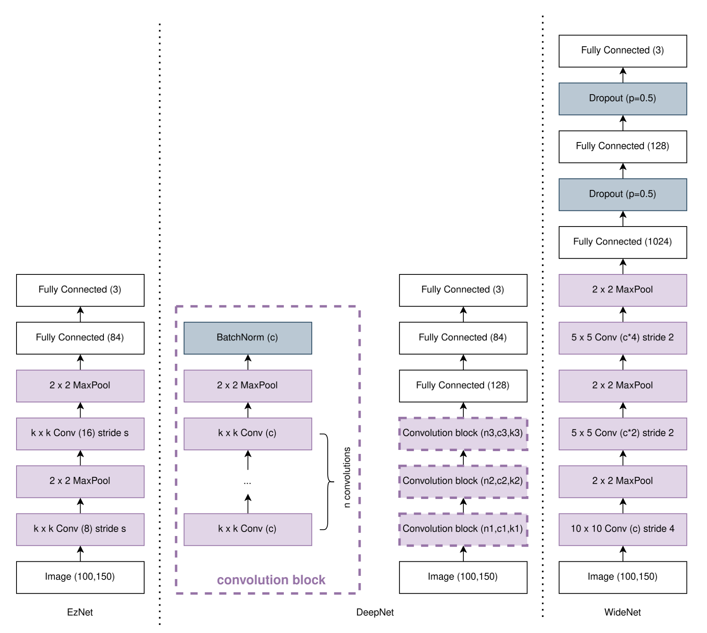
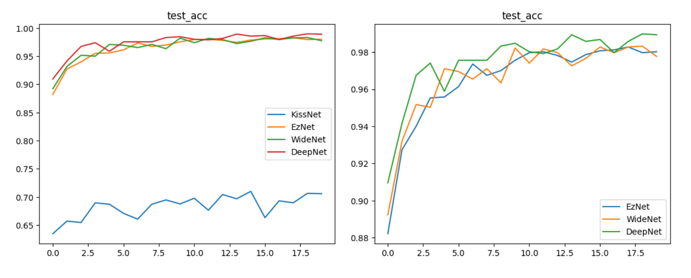
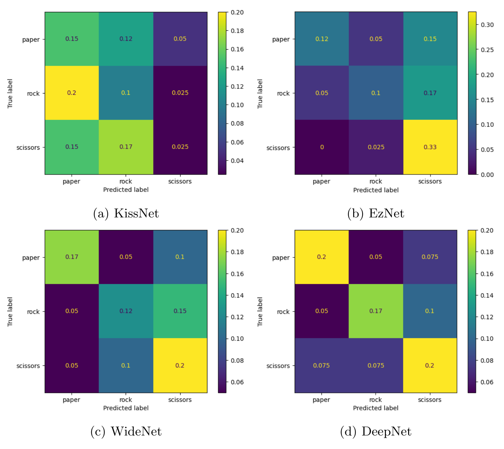

# CNN for Rock-Paper-Scissors Classification

Convolutional neural networks for classifying hand-gesture images from the classic Rock-Paper-Scissors game, 
with a focus on rigorous hyperparameter selection and evaluation of real-world generalization.

## Overview

This project compares four CNN architectures on an image classification task, tuning each with **nested cross-validation**
to get an unbiased estimate of generalization performance. 
Beyond the standard train/test split, the models are also stress-tested on a **second, independently collected dataset** (different subjects, lighting, and backgrounds) 
to evaluate how well they generalize outside the narrow conditions of the original data.

## Dataset

- **Source**: [Rock-Paper-Scissors Images](https://www.kaggle.com/datasets/drgfreeman/rockpaperscissors) (Kaggle)
- 2,188 images across 3 balanced classes (rock / paper / scissors), 200×300 px, consistent
  background and lighting
- A secondary, self-collected dataset (5 subjects, varied backgrounds/lighting/perspective)
  is used purely as an out-of-distribution test set to probe generalization

## Models

| Model | Description |
|---|---|
| **KissNet** | Single fully-connected layer; baseline to contextualize the CNNs' performance |
| **EzNet** | LeNet-5-inspired architecture, adapted with ReLU activations and more filters for RGB input |
| **WideNet** | 3 convolutional layers that double channel width at each step, testing whether wider representations improve accuracy |
| **DeepNet** | Configurable convolution blocks (depth, channels, kernel size) with batch normalization, exploring whether depth beats width |

## Methodology

- **Preprocessing**: 90/10 train/test split, tensor conversion, resizing, normalization
- **Data augmentation** (training set only): random vertical flip, random rotation (±20°),
  color jitter (brightness/hue/saturation/contrast) — chosen to reflect realistic variation
  given the fixed camera framing of the source dataset
- **Hyperparameter tuning**: nested cross-validation (k=3 to k=5 depending on the model),
  with grid search used where the hyperparameter space was small enough to be exhaustive
  (EzNet); other architectures tuned by direct comparison across a shortlist of configurations
- **Evaluation**: k-fold cross-validation (k=8) risk estimates, held-out test set accuracy, and
  confusion matrices on the out-of-distribution generalization dataset

## Results

- All CNNs (EzNet, WideNet, DeepNet) achieve near-perfect accuracy on the original
  train/test split, with DeepNet showing the lowest expected risk
- On the independently collected generalization dataset, performance drops substantially
  for every model — DeepNet degrades the most gracefully, better capturing hand shape
  independent of lighting/background, while the simpler models fall back to guessing the
  most frequent class
- This gap highlights how easily a model can look strong on a narrow dataset while failing
  to generalize, and motivated the choice to report both numbers rather than only the
  original test accuracy

See the [full report](./report.pdf) for architecture diagrams, training curves, and detailed
metrics.

## Tools

- **ML framework**: PyTorch
- **Environment**: Google Colab (T4 GPU) and local CPU training
- **Techniques**: CNNs, nested cross-validation, grid search, data augmentation
